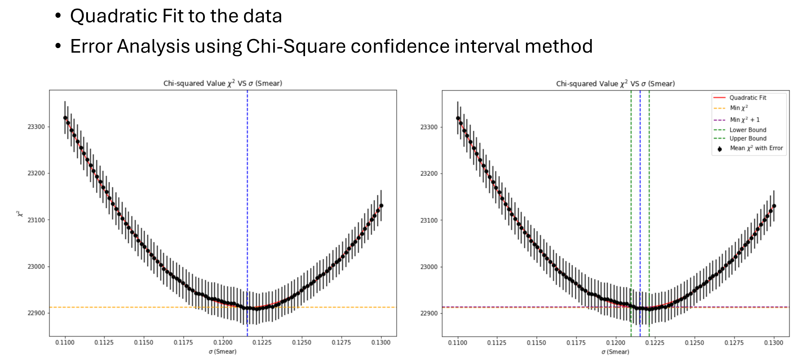
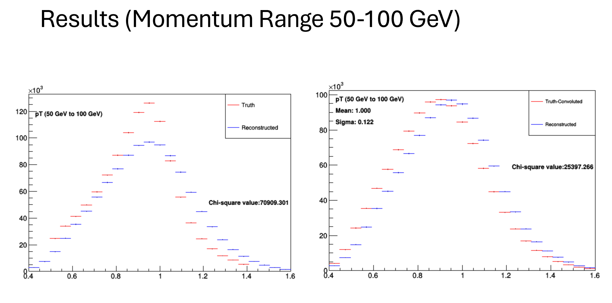
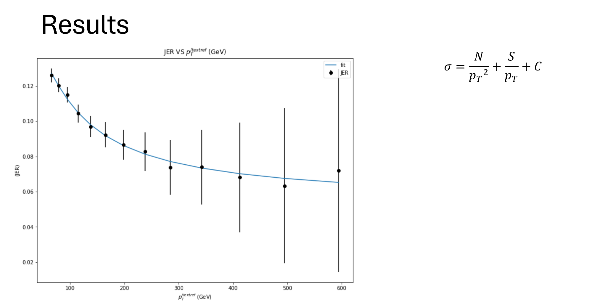

# LHC-ATLAS-jet-calibration-forward-folding

Analysis pipeline for calibrating hadronic jets, developed for my Honours Thesis (Carleton University, 2025) as part of the ATLAS experiment at CERN.  
The project applies the forward folding technique to Monte Carlo–simulated Z+jet events in the ATLAS detector to extract detector effects.

---

## Project Overview
This project calibrates hadronic jet measurements in the ATLAS detector by extracting two key performance parameters:

- **Jet Energy Scale (JES):** how closely measured jets match their true energy  
- **Jet Energy Resolution (JER):** the precision of those measurements  

The analysis uses the forward folding technique: truth-level Monte Carlo jets are modified with simulated detector effects and compared with reconstructed jets. Optimal parameters are obtained through χ² minimization.

---

## Methodology
1. Generate truth-level jet distributions from Monte Carlo simulation  
2. Apply detector effects using Gaussian smearing (convolution)  
3. Run χ² scans over scale (μ) and resolution (σ) parameters  
4. Fit quadratic functions around χ² minima to extract JES and JER  
5. Estimate uncertainties with error propagation and random seed averaging  


---

## Key Contributions
- Unified approach to determine JES and JER simultaneously  
- Optimized runtime by replacing slow ROOT histogramming with NumPy vectorization  
- Reduced statistical fluctuations with multiple random seeds  
- Produced calibration results consistent with established methods  

---

## Findings
Forward folding produced calibration factors and resolutions consistent with ATLAS models, validating the approach.  
Remaining challenges include limited statistics at high energies and refinement of uncertainty treatment.

---

## Example Results

### χ² Scan and Error Estimation
Illustrates the quadratic fit and confidence interval method used to extract the resolution.


### Truth vs Reconstructed Jets (pT 50–100 GeV)
Comparison of truth-level and reconstructed jets, showing detector effects before calibration.


### Jet Energy Resolution vs pT
Final JER curve with functional fit, demonstrating the detector’s resolution across energies.



---

## Skills Demonstrated
- **Languages/Tools:** Python, NumPy, Matplotlib, Jupyter, ROOT  
- **Techniques:**  
  - Statistical modeling and parameter estimation  
  - Numerical optimization (χ² minimization)  
  - Performance tuning with vectorization  
  - Uncertainty analysis and error propagation  
  - Reproducible scientific workflows  

---

## Repository Structure
- `notebooks/` — Jupyter notebook with main analysis  
- `results/` — Selected plots (χ² scans, JES/JER fits)  
- `requirements.txt` — Python dependencies  
- `LICENSE` — MIT open-source license  

---

## How to Run
```bash
# Clone the repository
git clone https://github.com/ratulkannan-atelier/LHC-ATLAS-jet-calibration-forward-folding.git
cd LHC-ATLAS-jet-calibration-forward-folding

# Install dependencies
pip install -r requirements.txt

# Open the analysis notebook
jupyter notebook notebooks/forward_folding_analysis.ipynb
